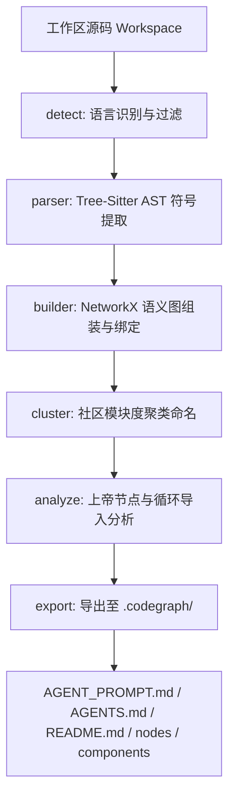

# codegraph

`codegraph` 是一个面向 AI Agent（如 Antigravity、Codex、Claude Code 等）的静态代码知识图谱生成工具。它能够静态解析多语言 codebase，通过社区发现算法自动进行组件聚类，并导出为由标准 Markdown 文件组成的关联图谱库（Obsidian-like vault），极大地辅助 AI Agent 在本地进行精准的架构理解、逻辑导航与深度洞察分析。

与基于图形化 Canvas 渲染的知识图谱不同，`codegraph` 采用全 Markdown 的扁平结构存储。它专门为 LLM 设计，摒弃了昂贵且复杂的数据库依赖，让 AI Agent 可以通过标准文件读取与路径导航（Relative Links）轻松周游整个代码库。

---

## 🚀 核心特性

- **多语言 AST 解析**：基于 `tree-sitter`，原生支持 **Python, JavaScript, TypeScript, Go, Rust, Swift**。
- **语义边解析与绑定**：静态解析跨文件的函数/方法调用（`calls`）、类型继承/接口实现（`inherits`/`implements`）以及文件导入关系（`imports`）。
- **逻辑组件自动聚类**：利用贪心模块度社区发现算法（Louvain Modularity Clustering）将紧密耦合的文件和符号自动聚类为 **Component（逻辑组件）**，并根据组件核心节点智能命名。
- **架构脆弱性分析**：自动识别 **God Nodes（度数最高的核心抽象）**，并静态检测文件级别的 **循环导入依赖（Circular Imports）**。
- **Agent 友好交互协议**：生成离线 Agent 提示词文件 `AGENT_PROMPT.md` 与规则文件 `AGENTS.md`，实现零 API 成本的 Agent 驱动型架构洞察分析。

---

## 📦 架构概览



---

## 🛠️ 安装指南

推荐使用 [uv](https://github.com/astral-sh/uv) 管理项目依赖与虚拟环境：

```bash
# 克隆仓库
git clone <repository-url>
cd codegraph

# 同步依赖并激活虚拟环境
uv sync
source .venv/bin/activate

# 全局安装 (推荐)
uv tool install --force --no-cache .
```

### 2. 注入 AI Agent 斜杠命令集成

`codegraph` 支持一键将 `/codegraph` 自定义斜杠命令注册到您的 AI Agent（如 Codex 或 Antigravity）的全局配置中：

```bash
# 为 Codex / Antigravity 注入 /codegraph 全局斜杠命令
codegraph install --platform codex
```

注册完成后，在对应的 Agent 终端中，您只需输入 `/codegraph` 即可全自动运行整个图谱的提取、分析与回写流程。

---

## 📖 使用方法

### 1. 构建代码图谱

在项目根目录下运行 `codegraph build`，默认会扫描当前文件夹并将图谱输出至 `.codegraph/` 目录下：

```bash
# 扫描当前目录并生成图谱
codegraph build .

# 指定自定义输出目录
codegraph build . --output my_vault/

# 排除指定文件夹
codegraph build . --exclude extra_folder/ --exclude docs/
```

### 2. 导出 vault 目录结构

输出的 `.codegraph/` 是一个自包含的 Markdown 知识图谱数据库，结构如下：

```
.codegraph/
├── README.md               # 图谱主索引，包含统计、Mermaid 组件依赖图、上帝节点、循环依赖及 AI 架构洞察
├── AGENT_PROMPT.md         # 供外部 AI Agent 读取的架构分析提示词模版
├── AGENTS.md               # 外部 AI Agent 协同工作规则与导航指南
├── components/             # 聚类生成的逻辑组件详情（如 Component_3_BaseParser_.md）
└── nodes/                  # 所有物理文件和符号的详情（包含定义签名、双向调用链与 Mermaid 拓扑）
```

---

## 🤖 与 AI Agent（Codex / Antigravity / Claude Code）协同分析

`codegraph` 的核心设计思想是**离线构建，Agent 分析**。这避免了在 CLI 中直接硬编码大模型 API，降低了使用成本，并充分利用了你当前对话中功能更强、带有上下文读取能力的外部 Agent。

### 步骤 1：生成本地图谱

运行以下命令，为你的 codebase 生成静态图谱底座：
```bash
codegraph build .
```

### 步骤 2：在 Agent 中一键触发分析

打开你的 AI Agent（如 Codex、Antigravity 或 Claude Code 终端），直接向它发送以下指令：

> 💡 **分析指令**：
> `请读取并遵循 .codegraph/AGENT_PROMPT.md 中的提示要求，对本项目进行深度架构分析，然后将中文分析报告写入 .codegraph/README.md 文件的 “AI 架构深度洞察” 章节中。`

Agent 将自动利用其文件读写能力：
1. 读取 `.codegraph/AGENT_PROMPT.md` 获取元数据和 Mermaid 关系。
2. 进行推理，并在 `.codegraph/README.md` 的 `## AI 架构深度洞察` 章节中生成专业的中文架构报告。

### 步骤 3：日常问答与逻辑导航

AI Agent 能够非常聪明地利用该图谱来导航庞大的 codebase。当你想问代码结构时，指示它利用图谱即可：
- *“哪个组件依赖了 BaseParser？”* -> Agent 会读取 `components/` 下的组件文件。
- *“调用这个函数的入口在什么地方？”* -> Agent 会查看 `nodes/` 下对应节点文件的 `Incoming Calls`。

---

## 📜 规则设置（自动感知）

如需让 AI Agent 在进入仓库时自动使用 `.codegraph`，你可以在根目录下创建 `CLAUDE.md` 或在 `README.md` 中引用 `.codegraph/AGENTS.md` 中的规则。
例如在 `CLAUDE.md` 中写入：
```markdown
- Before answering architecture or codebase questions, read .codegraph/README.md for god nodes and community structure.
- Navigate .codegraph/components/ and .codegraph/nodes/ instead of reading raw code files directly.
- After modifying code files, run `codegraph build .` to keep the graph current.
```
